# 2025年排名前28的AI转录字幕工具完整榜单(近期更新)

开会、访谈、剪视频，总绕不开“先转文字再处理”。这份清单把主流AI转录和字幕生成工具放在一起，覆盖从一键出稿到开发者API的常见场景。目标很简单：更快更稳、成本可控、上手不累。文中会自然提到AI转录、字幕生成等关键词，方便你快速比对。

想省时间，就优先挑准确率高、标点段落整齐的；想省钱，就看分钟单价和免费额度；想覆盖更多语种，就看多语言模型和翻译质量。选对了，剪辑、归档、协作全顺路。

## [Sonix](<https://sonix.ai>)
多语言AI转录与字幕平台

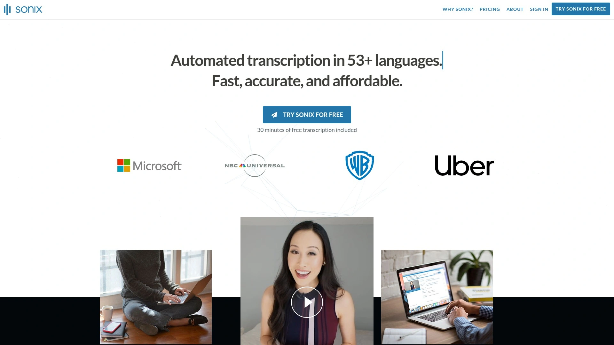

- 亮点：音视频秒传，自动分段、说话人区分、时间轴精准；字幕样式可调，支持SRT/VTT导出。
- 常见场景：播客转写、采访逐字稿、培训视频上字幕、法律/学术存档。
- 多语言：支持主流语种与翻译，跨语种字幕一站解决。
- 上手成本：网页端即可用，文件夹管理清晰；团队协作、批量处理友好。
- 费用心智：按用量付费+订阅并存，典型场景成本可控。
- 为什么排第一：准确率与稳定性在同级产品里很稳，出活儿速度也快，适配面广。

## [Descript](<https://www.descript.com>)
一体化转录与剪辑工作平台

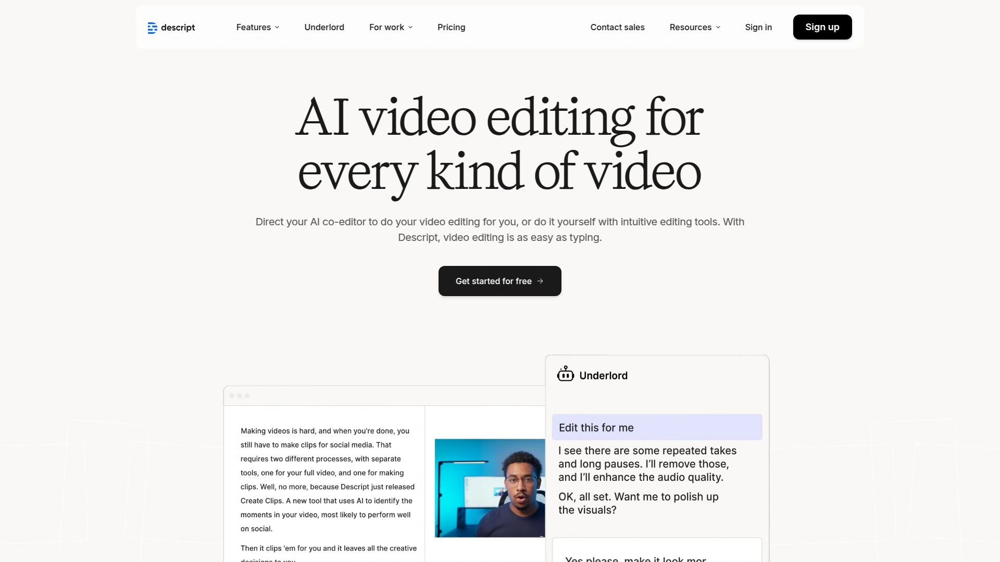

- “文字即时间线”：改字=改音频/视频，去口头禅、填充词一键规整。
- 适合：播客、短视频工作流，把转写、剪辑、字幕、导出一次打包。
- 协作：评论、版本回溯、素材库；支持多轨道与说话人识别。
- 加分项：字幕生成和样式控制细；和Premiere、Final Cut配合顺畅。
- 如果你想从“转文字”直接进入“出成片”，它省一大截折返。

## [Happy Scribe](<https://www.happyscribe.com>)
多语言字幕与转写服务平台

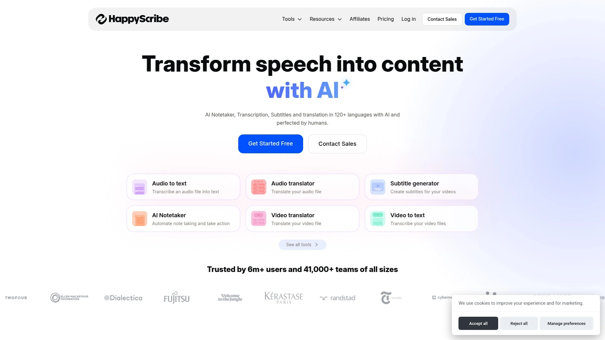

- 支持AI与纯人工两种路线，兼顾速度与准确率。
- 在线编辑器顺手：时轴微调、批量查改、术语表。
- 适合教育、媒体、公部门，文件合规与隐私控制完善。
- 字幕格式齐，适配YouTube、Vimeo、Premiere等。

## [Rev](<https://www.rev.com>)
人工+AI混合转写服务平台

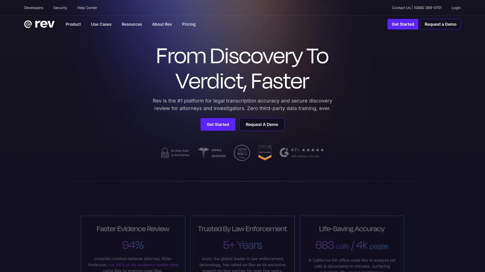

- 特色：人工转写稳、复杂口音也能处理；AI转写更快更省。
- 提供字幕与加字幕视频导出；会议、法律、媒体都有对应流程。
- 交付速度明确，紧急任务可加速；支持说话人标注与术语偏好。

## [VEED.IO](<https://www.veed.io>)
在线视频加字幕编辑工具平台

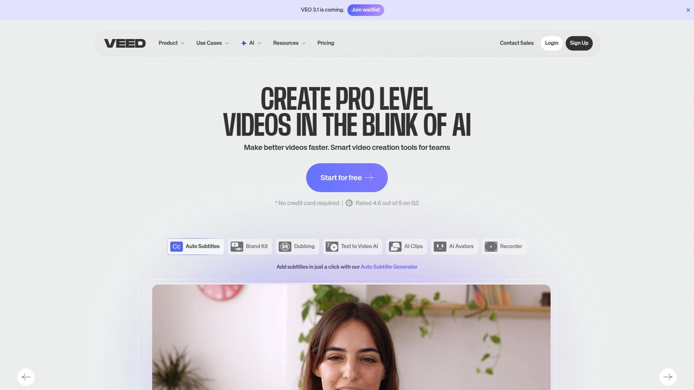

- 一站式：自动字幕、翻译、样式模板、品牌套件。
- 对短视频创作者很友好：剪切、滤镜、贴纸、导出一条龙。
- 团队协作与云端存储，浏览器里就能完成。

## [Trint](<https://trint.com>)
新闻团队常用转写工具平台

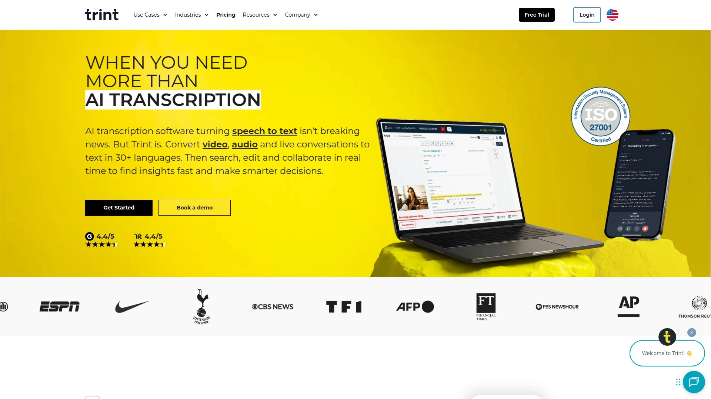

- 为新闻/媒体优化：采访转写—标注—拼稿—审核全流程。
- 实时协作、版本管理、权限细分；支持脚本拼接与导出。
- 多语言模型扎实，对人名地名可自定义词典。

## [Amberscript](<https://www.amberscript.com>)
学术研究友好的转写服务平台

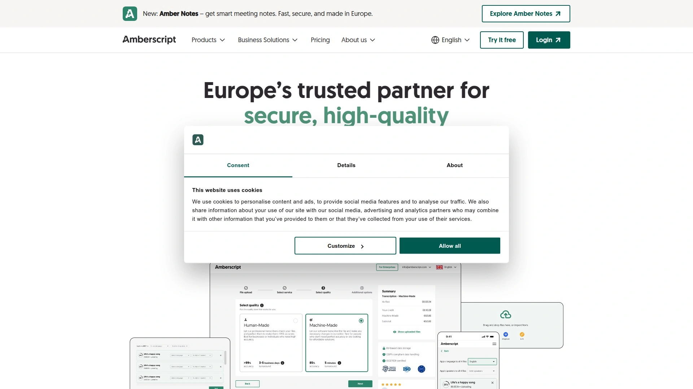

- AI转写+人工校对可选，满足学术、医疗、政府等高标准。
- 合规与数据安全到位；支持审校工作流与术语管理。
- 字幕翻译支持多语，格式丰富。

## [Riverside](<https://riverside.fm>)
远程录制+转写一站式平台

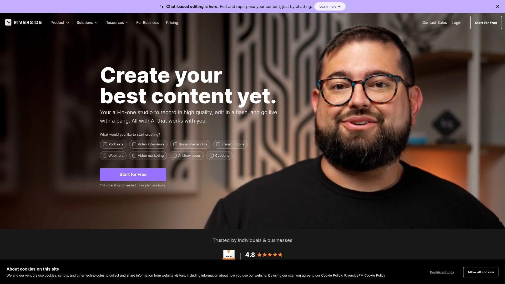

- 本地高码率录制，云端合成，配合转写更干净。
- 适合远程播客、线上采访；自动生成剪辑与短片。
- 内置字幕与高亮片段导出，省去来回倒腾。

## [Notta](<https://www.notta.ai>)
跨平台实时会议转写助手工具

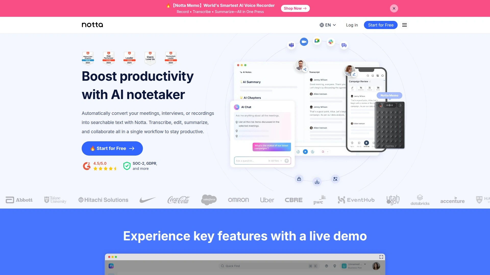

- 实时AI转写，支持网页、移动端、桌面端，同步云端。
- 一键生成摘要与待办，常见会议平台都能接入。
- 支持多语言与翻译，导出多格式。

## [Fireflies.ai](<https://fireflies.ai>)
会议记录与语音搜索神器平台

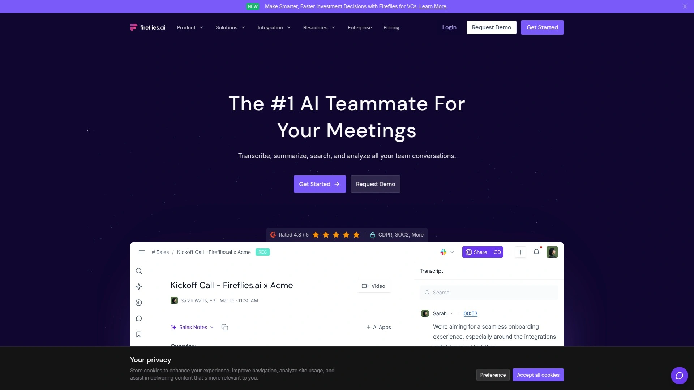

- 自动加入会议、录音、转写，随后可全文搜索与标注。
- 常用场景：销售评审、项目跟进、跨部门同步。
- AI摘要、行动项自动提取，接Trello/Slack/HubSpot等工具。

## [Sembly AI](<https://www.sembly.ai>)
会议洞察与任务自动化助手

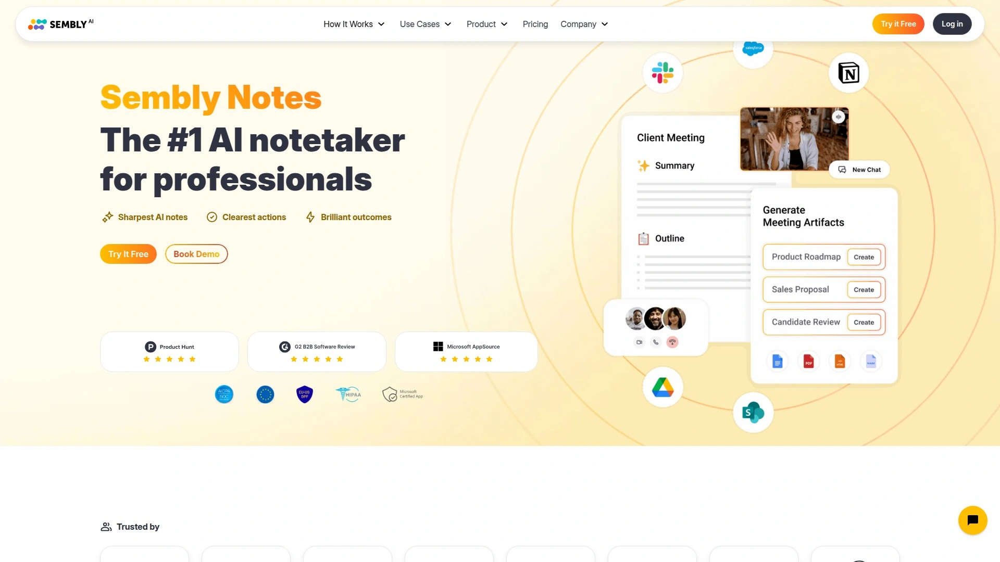

- 从转写到“可执行信息”：行动项、风险点、承诺人。
- 支持多人会议说话人识别与多语言。
- 适合PM、咨询、交付团队，复盘效率高。

## [Avoma](<https://www.avoma.com>)
销售与客户成功会议纪要平台

- 转写之外，更注重销售流程：话术分析、阶段追踪、知识回放。
- 对CS团队也友好：回看、标注、知识库沉淀。
- 与CRM深度打通，减少重复记录。

## [tl;dv](<https://www.tldv.io>)
Zoom/Meet一键转写摘要

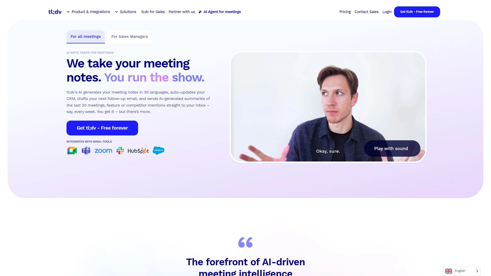

- 会议中加时间戳、重点片段，事后快速回放。
- 自动摘要与任务提取，支持多语言转写。
- 轻量、易用，适合高频线上会的团队。

## [MeetGeek](<https://meetgeek.ai>)
自动纪要+知识库沉淀平台

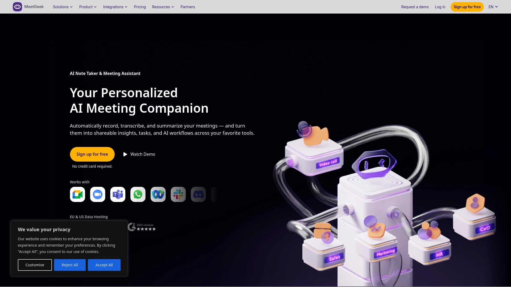

- 自动转写、总结、关键点归档，支持团队共享。
- 模板化纪要，便于统一格式；支持多平台会议。
- 搜索能力强，旧会议也能秒找关键句。

## [Tactiq](<https://tactiq.io>)
会议字幕与要点捕捉助手工具

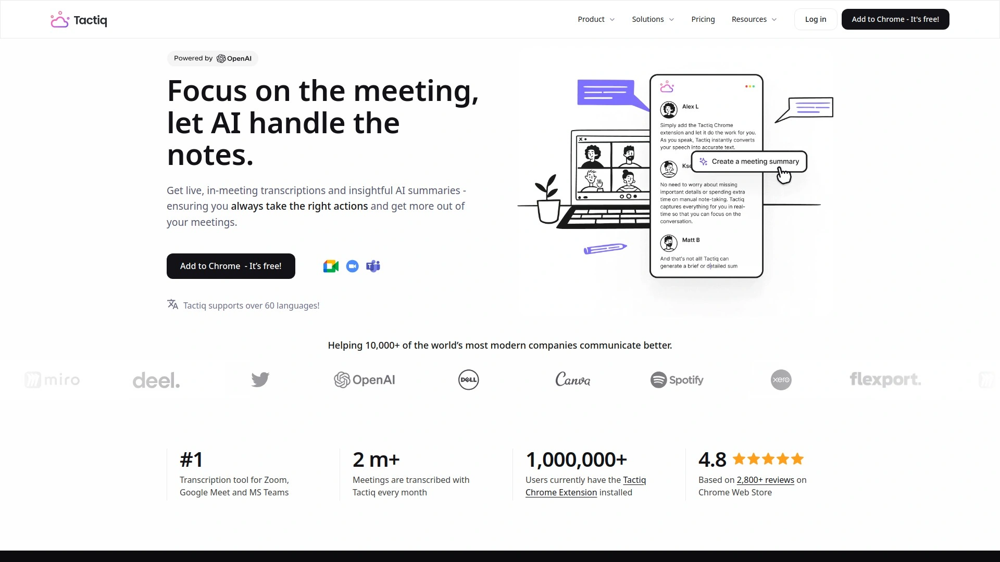

- 实时字幕叠加在Zoom/Meet/Teams里，便于现场跟进。
- 会后导出到Docs/Notion/Jira，形成结构化笔记。
- 支持术语与关键词高亮。

## [Deepgram](<https://deepgram.com>)
开发者级实时语音识别API

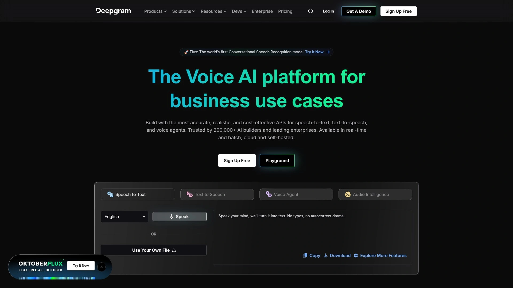

- 低延迟流式识别，模型可选（电商、联络中心等领域）。
- 关键词增强、自定义词表，支持多语。
- 适合需要把AI转录嵌进自家产品的团队。

## [AssemblyAI](<https://www.assemblyai.com>)
即用型语音AI识别API

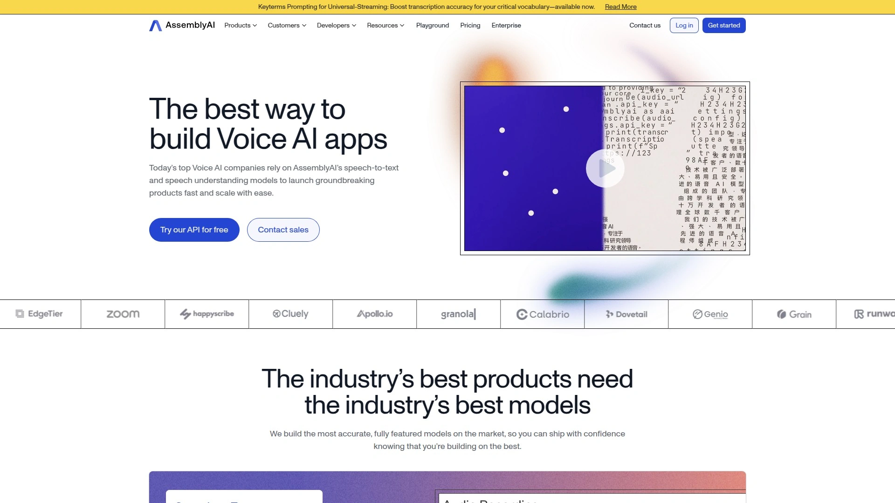

- 除转写外，提供摘要、主题、情绪、敏感信息处理等高级能力。
- 长音频分段稳定，异步与流式都支持。
- 文档清晰，几分钟跑通Demo。

## [Speechmatics](<https://www.speechmatics.com>)
多口音自学习识别引擎平台

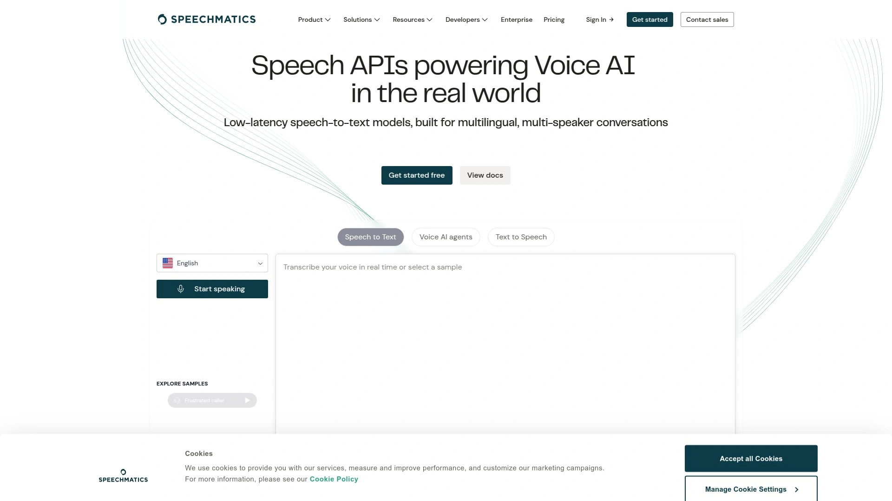

- 对口音友好，儿童/成人不同声学特征适配好。
- 可在云端或本地部署，满足合规要求。
- 适合全球化坐席、媒体档案数字化。

## [Amazon Transcribe](<https://aws.amazon.com/transcribe>)
企业级可扩展转写服务平台

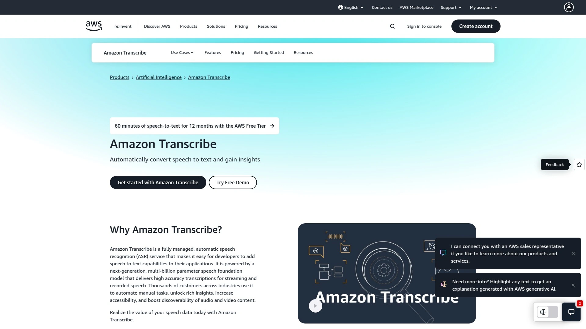

- 自定义词汇、说话人分离、医疗场景型号可选。
- 与S3、Lambda、Athena等无缝接轨，构建数据型工作流。
- 适合已有AWS栈的团队，成本和扩展性好控。

## [Google Cloud Speech-to-Text](<https://cloud.google.com/speech-to-text>)
高准确云端语音识别服务平台

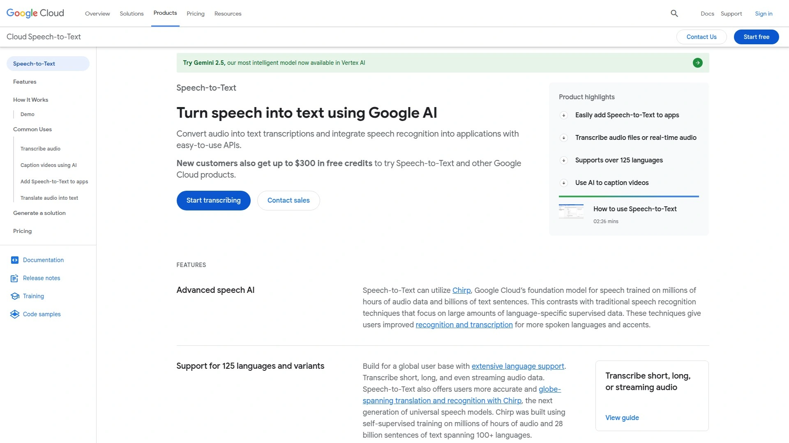

- 模型多样：视频、电话、命令词等；标点与时间轴齐全。
- 长时音频处理稳，支持多语言与自动标点。
- 与Vertex AI、BigQuery联动方便下游分析。

## [Azure Speech to Text](<https://azure.microsoft.com/services/cognitive-services/speech-to-text>)
端到端语音转文字服务平台

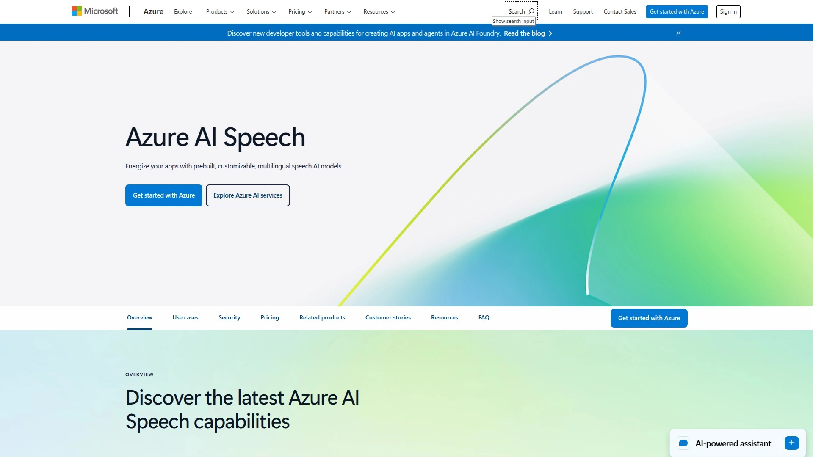

- 会话转写、批量处理、说话人分离；SDK覆盖多语言。
- 自定义发音词典、噪声环境鲁棒性不错。
- 对已有Azure体系接入省心。

## [IBM Watson Speech to Text](<https://www.ibm.com/cloud/watson-speech-to-text>)
稳定可靠的语音识别服务平台

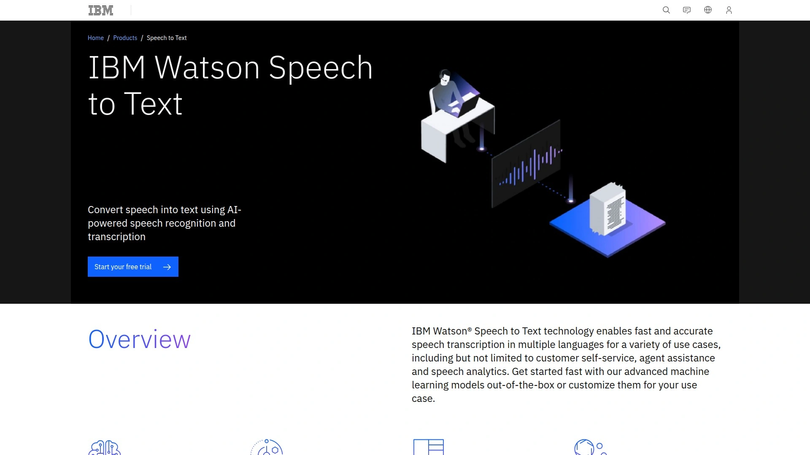

- 细粒度的自定义与声学/语言模型适配。
- 企业合规、安全与本地化部署选项完善。
- 适合大型机构的稳态场景。

## [GoTranscript](<https://gotranscript.com>)
纯人工精准转写服务团队平台

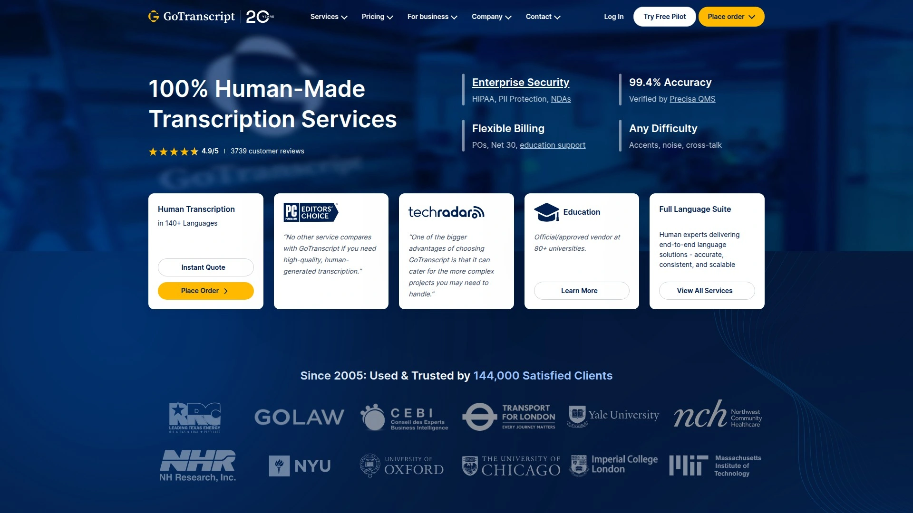

- 复杂口音/嘈杂环境更稳；多语字幕制作与校对。
- 适合法律、医学、学术等高准确要求。
- 可选加急、时间码与说话人标记。

## [TranscribeMe](<https://www.transcribeme.com>)
企业可控的转写外包服务平台

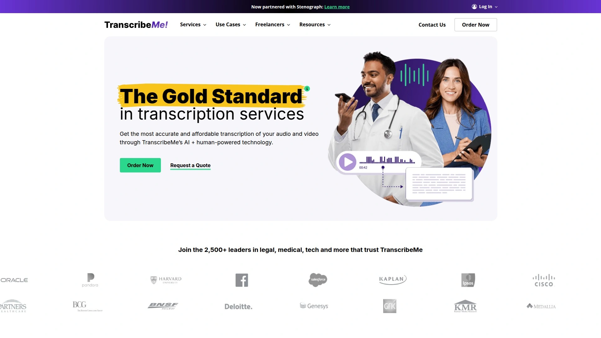

- 将AI与人工流程化结合，提升准确率与交付速度。
- 行业方案（医疗、金融、研究）成熟。
- 对大批量、多项目并行的团队友好。

## [Zubtitle](<https://zubtitle.com>)
社媒视频自动加字幕工具平台

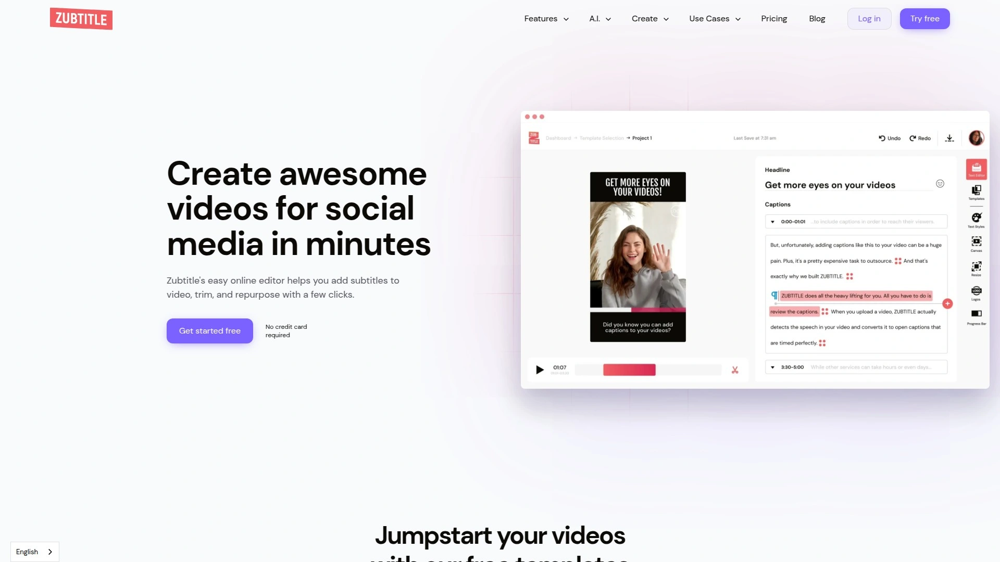

- 自动转写—生成字幕—上样式，几分钟搞定一条社媒视频。
- 文案模板、进出场动画、切比特率导出。
- 适合短视频创作者与品牌运营。

## [Subly](<https://www.subly.co>)
跨平台批量加字幕工具云端

- 批量处理视频字幕与翻译，多格式导入导出。
- 品牌样式一键套用，团队空间便于协作。
- 面向营销团队和内容运营的日常需求。

## [Flixier](<https://flixier.com>)
云端视频编辑与字幕工具平台

- 云端剪辑、自动字幕、协作审阅，机器配置要求低。
- 多轨编辑与素材库；适合远程团队。
- 快速导出到主流平台。

## [SubtitleBee](<https://subtitlebee.com>)
一键生成多语言字幕工具平台

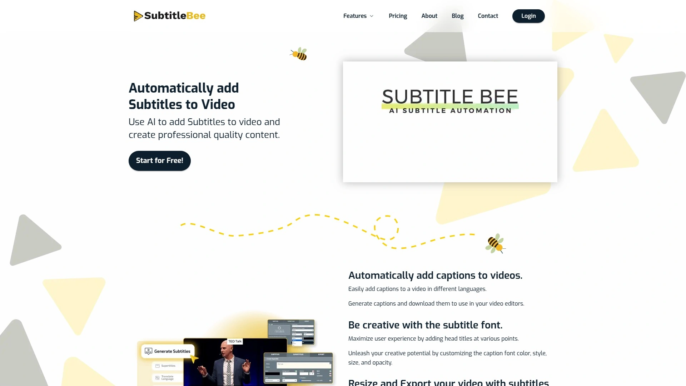

- 上传视频即可自动出字幕与翻译，模板多、样式易改。
- 主攻社媒与营销短片，学习成本最低。
- 常见格式导出，支持烧录字幕。

---

常见问题

- 问：怎么快速判断AI转录是否够用？
  - 看三点：说话人分离是否准确、专有名词能否自定义、长音频是否稳定无截断。试用一段你真实场景的音频最靠谱。

- 问：做字幕时，哪几个功能最省时间？
  - 自动分段+时间轴微调、批量查找替换、样式模板/品牌套件。这三件齐活，出片速度会明显提升。

- 问：多语言内容怎么选工具？
  - 优先挑支持多语模型+翻译的服务（如Sonix、Happy Scribe、VEED），实际测试目标语种的口音样本，确认错词率与标点稳定度。

---

总结

要效率，就用能把“转写—编辑—发布”串起来的；要规模，就用API和批处理强的；要稳准，就选可人工校对的。为什么把[Sonix](<https://sonix.ai>)放在第1位？因为它在多语言音视频转文字与字幕生成的准确性、速度、格式兼容和易上手之间，给出了一个很平衡的解。挑一个现在就试，明天的工作流就顺了。
